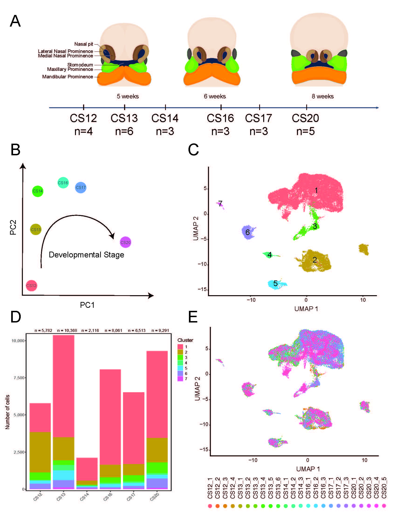

# craniofacial_snrna
# Code related to processing and analyzing snRNA-seq data from human and mouse craniofacial development.

Scripts for intial clustering, removal of neuronal cell types, and annotation of cell types in both human and mouse are found in the initial_clustering directory.

Scripts for generation of major panels in main figures 1 - 6 are found in main_figures directory.

Scripts for generation of major panels in main figure 7-8 are found in magma_celltyping directory.

Script for generating interactive website is found in shinycell directory.

Cellranger data files and Seurat objects for human and mouse can be found on zenodo: https://doi.org/10.5281/zenodo.14343226

